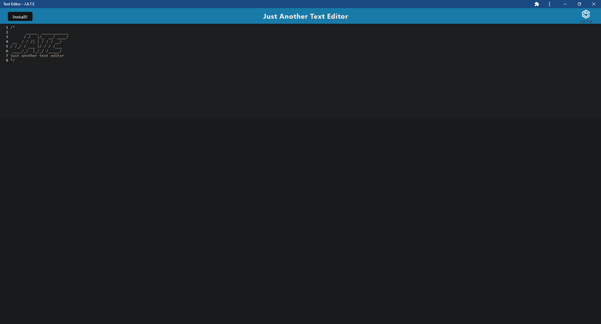
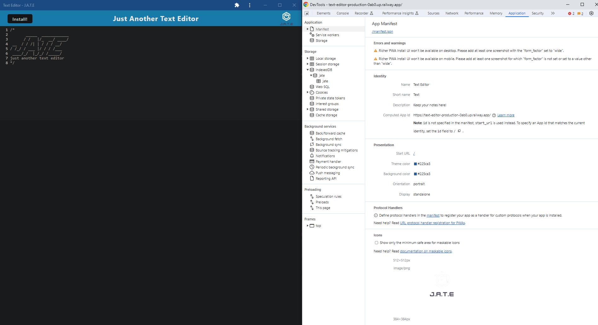
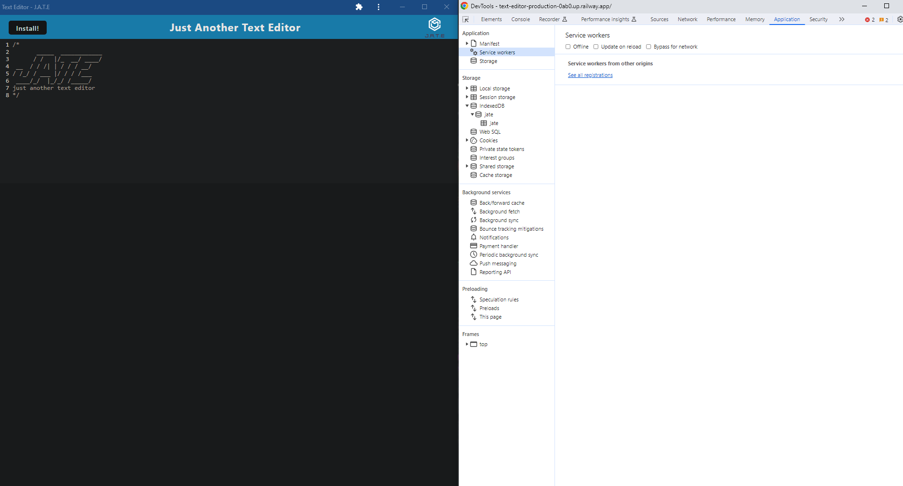
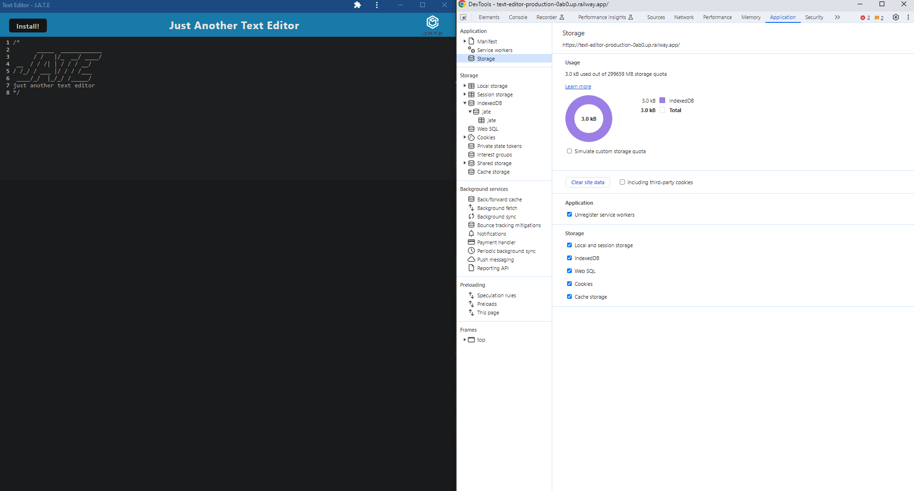
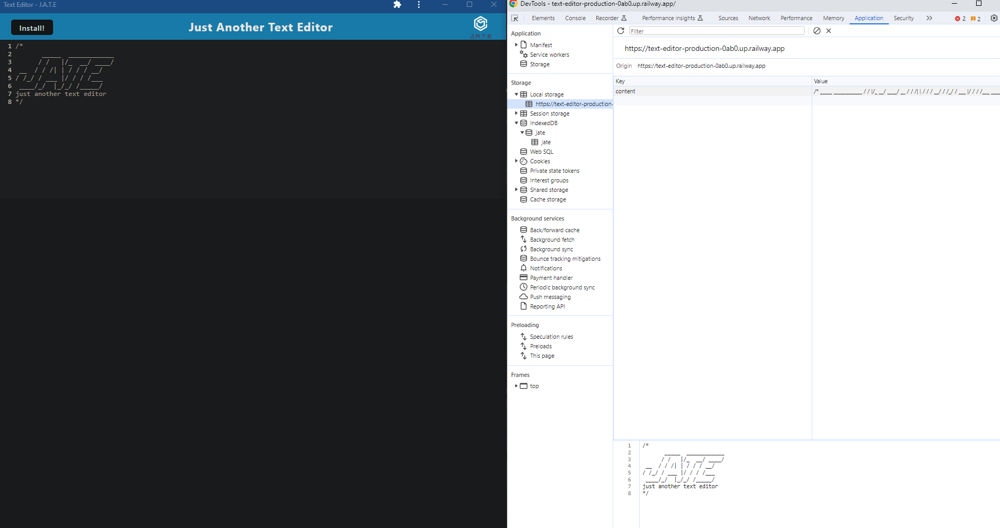
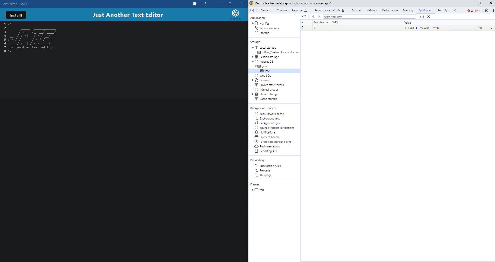

# text-editor

## Description
This application was built for the purpose of demonstrating and honing skills of progressive web application. Its purpose was to gather a greater understanding of what React JavaScript library is really doing behind the scenes. There are four main concepts this application focuses on. One, configuring the webpack.config.js file with the necessary workbox plugins for service worker and manifest files, and adding CSS and babel loader (enabling the CSS and JavaScript to compile on devices running on older legacy code i.e. ES5). Two, implementing asset caching within the src-sw.js file giving the application offline functionality. Three, configuring the database, so that data can be added, updated and retrieved from the IndexedDB. And four, adding the addition of event handlers to our install button, so that the application can be installed to each users personal application stack and be used offline.

## Screenshots

To view Webpage click [here] (https://text-editor-production-0ab0.up.railway.app/).

## Usage

Visit the link to the webpage to start adding notes right away!  Users will also notice an install button in the nav bar that allows the application to be downloaded and used offline.  Notes save automatically through the IndexedDB.
